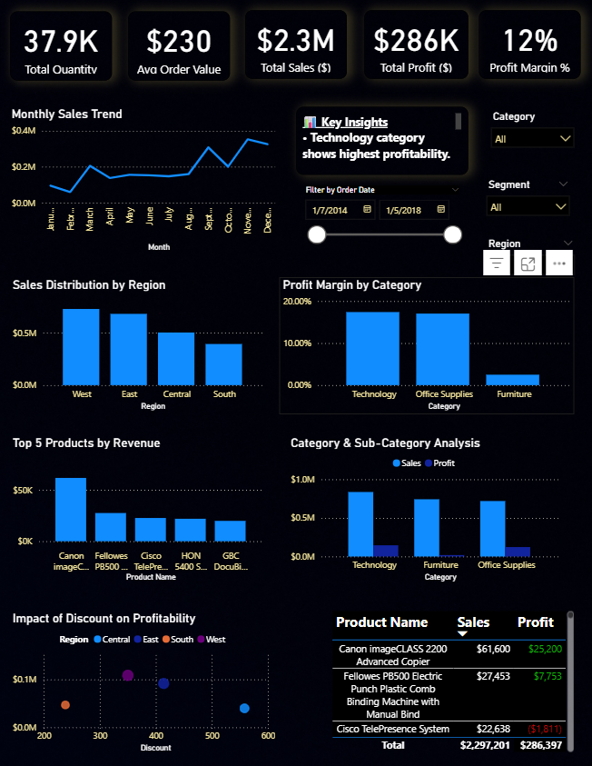

## **📊 Retail Sales Performance Dashboard (USA)**

### **📌 Project Overview**

This project analyzes retail sales data to identify key revenue drivers, profitability trends, and business insights using Power BI.

##### **🛠 Tools Used**

* Power BI
* Python (Data Cleaning)
* Excel

##### **📊 Key Features**

* KPI Tracking (Sales, Profit, Margin)
* Region-wise and Category Analysis
* Profit Margin Evaluation
* Discount vs Profit Analysis
* Identification of Loss-Making Products

##### 🧠 Key Insights

* Technology category shows highest profitability
* High discounts negatively impact profit margins
* Top products contribute majority of revenue
* Some products generate losses despite strong sales

##### 📸 Dashboard Preview

##### 💼 Business Impact

This dashboard helps in identifying profitable products, optimizing discount strategies, and improving overall business performance.
